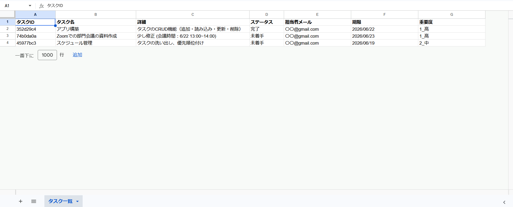
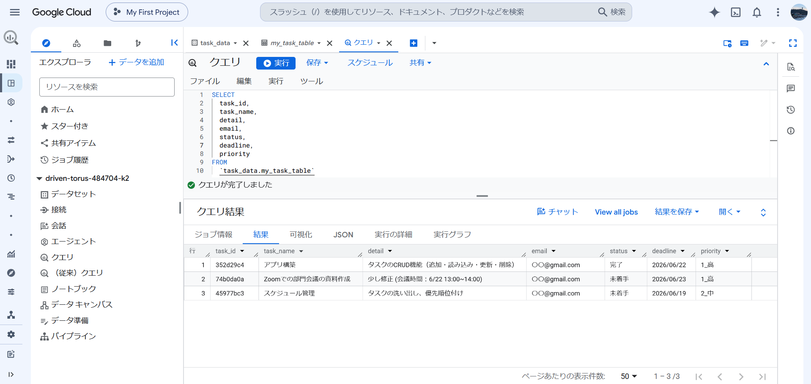
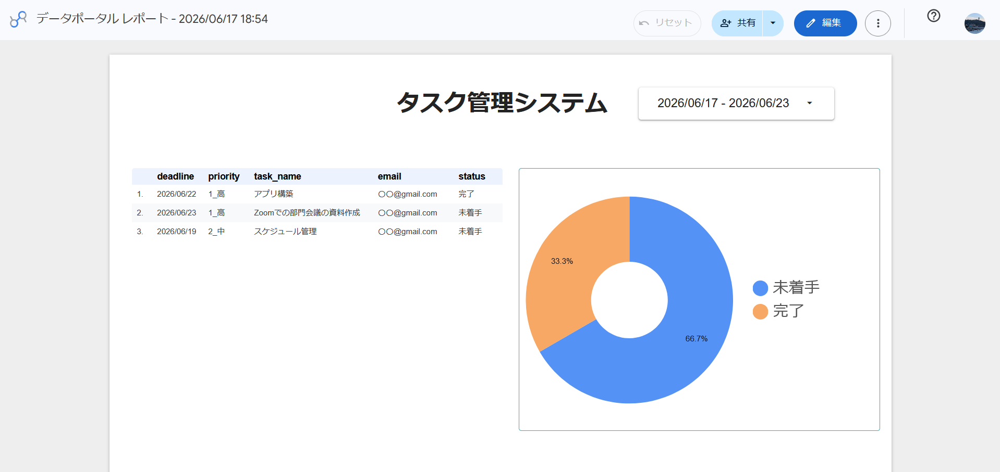

# AppSheet
新着タスクの自動Gmail通知Botを搭載！現場で即戦力になる実務特化型のAppSheetタスク管理システムです。

# 📱 AppSheet 実務特化型タスク管理・自動化システム

Googleスプレッドシートを裏側のデータベース（バックエンド）に使い、現場の「めんどくさい…」を解消する自動化機能（Automation）と、企業の「情報漏洩が怖い…」を解決する強固なセキュリティ（Slices）を詰め込んだ、実務向けのタスク管理アプリです。

---

## ✨ 本システムのメリット（ビジネス上の導入効果）

単なる「個人用のメモツール」ではなく、実際の業務現場における課題解決と導入効果を意識して開発しました。

### 1. セキュリティ：徹底した情報漏洩リスクの排除
一般的な共有ツールで発生しがちな「他人のタスクや社外秘情報の誤閲覧」を防ぐため、ログインユーザーをシステムが識別し、本人のデータのみにアクセスを制限する機能を実装しています。社員だけでなく、外注スタッフやアルバイトなど、多様な雇用形態のメンバーが混在する現場でも安心して運用可能です。

### 2. 業務効率化：連絡・リマインドコストの削減
タスクの割り当てに伴う手動での連絡漏れやタイムラグをなくすため、24時間稼働の自動化ボット（Automation）を構築しました。タスク追加と同時に担当者へリアルタイムで通知メールが送信されるため、管理者のリマインドにかかる工数を大幅に削減します。

### 3. コストパフォーマンス：短期開発による早期実用化
強固なログイン制限や自動通知機能を一からWeb開発（プログラミング）する場合、相応のコストと開発期間（数ヶ月〜）を要することが一般的です。本システムはAppSheetの特性を最大限に活かすことで、高いセキュリティ品質と自動化を担保したまま、短期間かつ最小限のコストでの構築・実用化を実現しています。

---

## 🚀 実装したコア技術・機能

### ① 動的セキュリティ制限（個人閲覧制限）
* **使用技術:** `USEREMAIL()` 関数 / `Slices` 機能
* **解説:** アプリにログインしたユーザーのメールアドレスをシステムが自動で判別します。他人のデータは一切表示されず、**「自分のタスクだけ」を厳密に表示・操作できる構造**を実装。企業導入時に必須となるセキュリティ要件をクリアしています。

### ② AppSheet Automation（自動メール通知ボット）
* **使用技術:** `AppSheet Automation (Bot / Event / Process)`
* **解説:** タスクが新しく追加された瞬間、バックグラウンドのBotがリアルタイムに検知し、担当者へ自動でリマインドメールを飛ばすワークフローを構築しました。手動での連絡コストを削減し、タスクの漏れを防ぐ実務仕様です。

### ③ データモデリング（バックエンド設計）
* **データソース:** Google スプレッドシート
* **解説:** データの重複や破綻を防ぐため、システム開発の基本であるリレーショナルなテーブル構造を意識した丁寧なデータベース設計を行っています。

---

## 📸 動作イメージ（タスク管理の実務フロー）

システムが実際に動く一連の流れ（データ登録〜自動通知〜完了処理まで）をステップ順に公開しています。

### 1. 初期状態：バックエンド（Google スプレッドシート）
- 1行目に明確な項目を定義し、データが何も入っていない空の状態からスタートします。

### 2. 初期状態：アプリ側（マイタスク画面）
- `USEREMAIL()` により、ログインしたユーザー専用の画面が自動生成されます。最初はタスクが空の状態です。

### 3. タスクの追加（入力フォーム - 前半）
- 現場スタッフが直感的に入力できるユーザーフレンドリーなフォームです。

### 4. タスクの追加（入力フォーム - 後半）
- 期限や重要度（Enum）、担当者メールアドレスなど、実務に必要な情報をスムーズに入力していきます。

### 5. アプリへのリアルタイム反映
- 登録した瞬間に、自分専用の「未完了タスク」一覧へ新着タスクとして即座に反映されます。

### 6. AppSheet Automation（自動メール通知）
- バックグラウンドのBotが追加を検知し、担当者のGmailへリアルタイムに自動リマインドメールを飛ばします。

### 7. バックエンドへの自動データ同期
- アプリで入力した内容が、裏側のGoogleスプレッドシートへもユニークなタスクID（独自のキー）と共に正確に自動書き込みされます。

### 8. ワンタップ完了アクション（処理前）
- 詳細画面に設置された「完了する」ボタンです。現場の使いやすさを考慮し、1タップでステータスを更新できる独自アクションを実装しています。

### 9. 完了アクション実行
- アクションボタンをタップした直後の状態です。ステータスが動的に「完了」へと切り替わります。

### 10. マイタスク一覧の動的アップデート
- 完了したタスクが一覧から自動的に消え、今やるべき「未完了タスク」だけがスマートに残ります。

### 11. 複数タスク運用時のリスト画面
- タスクが複数登録された状態の画面です。未完了・完了が混在しても、アプリ側で適切に整理・リスト化されて表示されます。

### 12. 最終状態：バックエンドへのリアルタイム反映（データ蓄積）
- 運用を重ねてデータが増えた状態のスプレッドシートです。アプリ側で行ったステータス変更（完了）や新規追加が、ズレなくリアルタイムに蓄積されていることが確認できます。
- ※セキュリティ保護のため、画面内のメールアドレスは「〇〇@gmail.com」等のダミー表記や変更・加工を行っています。

### 13. データ連携のためのバックエンド最適化（スプレッドシートの不要行削除）
BigQueryとのスムーズな外部連携や将来的なデータ容量の圧迫を防ぐため、スプレッドシートの末尾にあるシステム上の「空の行（不要な部分）」を綺麗にクリーンアップ・削除します。これにより、データベースが純粋なデータのみを正確にインポートできる状態に整えます。

### 14. BigQueryによる高速データ蓄積・SQLクエリ抽出結果
スプレッドシートからBigQueryへデータパイプラインを構築し、手動でスキーマ（列構成やデータ型）を定義しました。テストデータに対し、SQL（SELECT文）を用いて「必要な項目だけを一瞬で確実に抜き出す」クエリ抽出テストを行い、大量データの超高速処理に対応できる強固なデータ基盤が正常に機能していることを確認しています。

### 15. Looker Studioを用いた業務進捗ダッシュボード（レポート可視化・出力）
BigQueryで抽出したデータ基盤をフロントエンドのLooker Studio（旧データポータル）へリアルタイムに接続しました。期間コントロールによる動的な日付絞り込み機能のほか、期日が近いタスクを昇順で一覧表示する「重要タスク表」や、現在のタスク進捗率を一目で把握できる「進捗円グラフ（ドーナツ型）」を配置。管理者が現場の稼働状況を瞬時に判断し、迷わずリソース配分を行える実用的な経営・業務進捗管理レポート（ダッシュボード）を構築・可視化させました。

---

## 🔮 今後の拡張計画（検討している追加機能）

現状のベースシステムに加え、実際の業務現場における更なる効率化や運用改善を見据え、以下のような機能拡張を計画・検討しています。

### 1. 外部チャットツール（LINE Works / Slack / Teams）への自動通知連携
現在はタスク追加時にGmailで通知を行っていますが、現場で普及している主要なチャットツールへの通知拡張を検討しています。日常的に使用するツールへ直接通知を飛ばすことで、さらなる確認漏れの防止とリアルタイムな情報共有を強化します。

### 2. カレンダービューの追加と期限直前の「自動リマインド機能」
タスクの期限日を視覚的に把握しやすくするための「カレンダー表示（Calendar View）」の実装、および期限の「1日前」や「当日」に未完了のタスクをBotが自動検知し、担当者へ再通知を行うインテリジェントな自動催促機能を計画しています。

これに伴い、スプレッドシートに蓄積されたデータをBigQueryへ自動同期させて大量データの超高速処理に対応し、フロントエンドにLooker Studio（旧データポータル）を採用して連携。
管理者が業務の偏りを瞬時に判断し、適切なリソース配分を行えるような、より高度で直感的な経営・業務進捗ダッシュボードの構築を計画しています。
