# AppSheet
新着タスクの自動Gmail通知Botを搭載！現場で即戦力になる実務特化型のAppSheetタスク管理システムです。

# 📱 AppSheet 実務特化型タスク管理・自動化システム

Googleスプレッドシートを裏側のデータベース（バックエンド）に使い、現場の「めんどくさい…」を解消する自動化機能（Automation）と、企業の「情報漏洩が怖い…」を解決する強固なセキュリティ（Slices）を詰め込んだ、実務向けのタスク管理アプリです。

---

## ✨ 本システムのここが魅力！（ビジネス上のメリット）

単なる「自分用のメモ帳」ではなく、会社やチームの現場でそのまま使って価値が出るポイントにこだわりました。

### 1. 「情報漏洩リスク」をバシッとシャットアウト
一般的な共有ツールだと「他の人のタスクや社外秘の情報」まで見えてしまうリスクがありますが、このアプリはログインした本人の情報以外はシステム的にアクセスできない仕組みにしています。アルバイト、外注スタッフ、社員など、いろんな人が混在する現場でも安心して導入できます。

### 2. 「確認の手間」と「連絡コスト」をゼロに
「タスクを割り振ったからメールして、チャットも送って…」という手間のせいで、連絡漏れが起きたりしますよね。このアプリはBotが24時間体制で裏側で見張っていて、タスクが追加されると同時に自動で正確なメールを飛ばすため、管理者のリマインドの手間を完全にゼロにします！

### 3. 「スピード開発 ✕ 低コスト」の圧倒的コスパ
これほど強固なログイン制御や自動メール通知をゼロからプログラミング（Web開発）して作ると、数十万円以上のコストと1〜2ヶ月の期間がかかることも珍しくありません。AppSheetの特性をフルに活かすことで、セキュリティと自動化を担保したまま「数日」という圧倒的なスピード感と低コストで形にしています。

---

## 🚀 実装したコア技術・機能

### ① 動的セキュリティ制限（個人閲覧制限）
* **使用技術:** `USEREMAIL()` 関数 / `Slices` 機能
* **解説:** アプリにログインしたユーザーのメールアドレスをシステムが自動で判別します。他人のデータは一切表示されず、**「自分のタスクだけ」を厳密に表示・操作できる構造**を実装。企業導入時に必須となるセキュリティ要件をクリアしています。

### ② AppSheet Automation（自動メール通知ボット）
* **使用技術:** `AppSheet Automation (Bot / Event / Process)`
* **解説:** タスクが新しく追加された瞬間、バックグラウンドのBotがリアルタイムに検知し、担当者へ自動でリマインドメールを飛ばすワークフローを構築しました。手動での連絡コストを削減し、タスクの漏れを防ぐ実務仕様です。

### ③ データモデリング（バックエンド設計）
* **データソース:** Google スプレッドシート
* **解説:** データの重複や破綻を防ぐため、システム開発の基本であるリレーショナルなテーブル構造を意識した丁寧なデータベース設計を行っています。

---

## 📸 動作イメージ

> 💡 **確認方法:** 以下のフォルダー（`/images`）に実際のシステム画面を格納しています。

## 📸 動作イメージ（タスク管理の実務フロー）

システムが実際に動く一連の流れ（データ登録〜自動通知〜完了処理まで）をステップ順に公開しています。

### 1. 初期状態：バックエンド（Google スプレッドシート）
- 1行目に明確な項目を定義し、データが何も入っていない空の状態からスタートします。
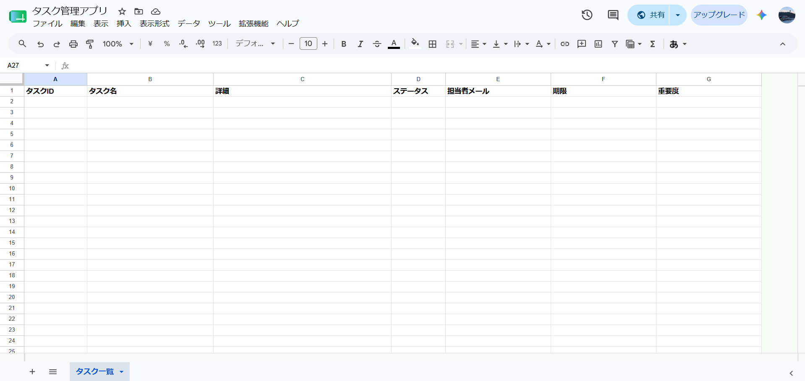

### 2. 初期状態：アプリ側（マイタスク画面）
- `USEREMAIL()` により、ログインしたユーザー専用の画面が自動生成されます。最初はタスクが空の状態です。
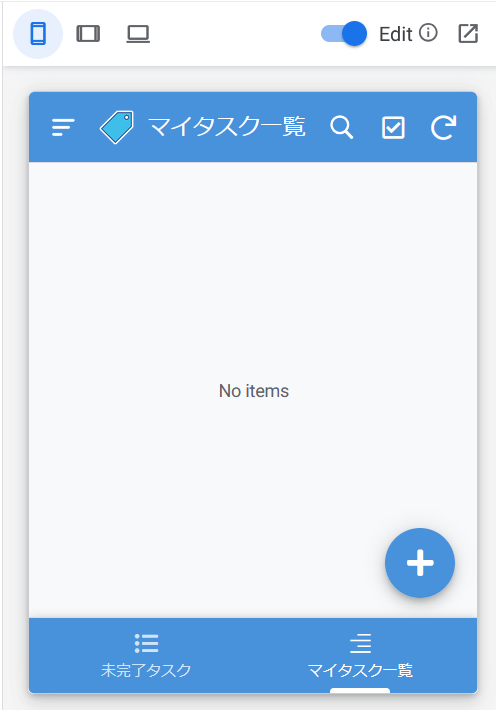

### 3. タスクの追加（入力フォーム - 前半）
- 現場スタッフが直感的に入力できるユーザーフレンドリーなフォームです。
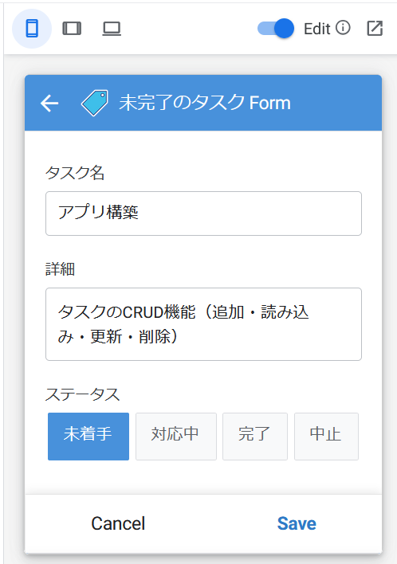

### 4. タスクの追加（入力フォーム - 後半）
- 期限や重要度（Enum）、担当者メールアドレスなど、実務に必要な情報をスムーズに入力していきます。
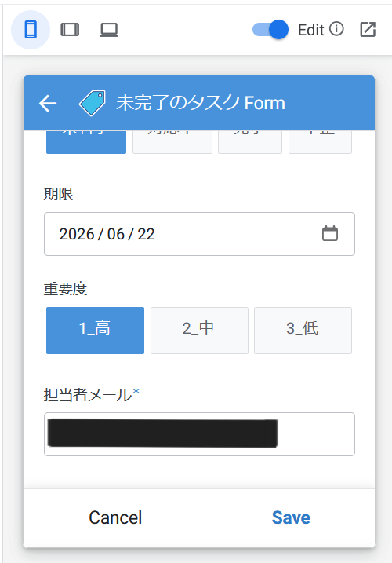

### 5. アプリへのリアルタイム反映
- 登録した瞬間に、自分専用の「未完了タスク」一覧へ新着タスクとして即座に反映されます。
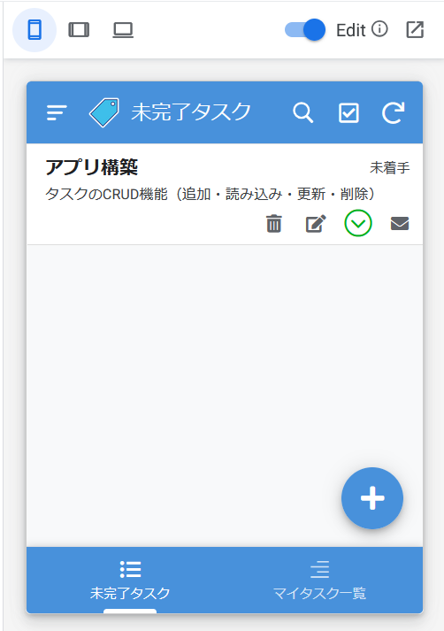

### 6. AppSheet Automation（自動メール通知）
- バックグラウンドのBotが追加を検知し、担当者のGmailへリアルタイムに自動リマインドメールを飛ばします。
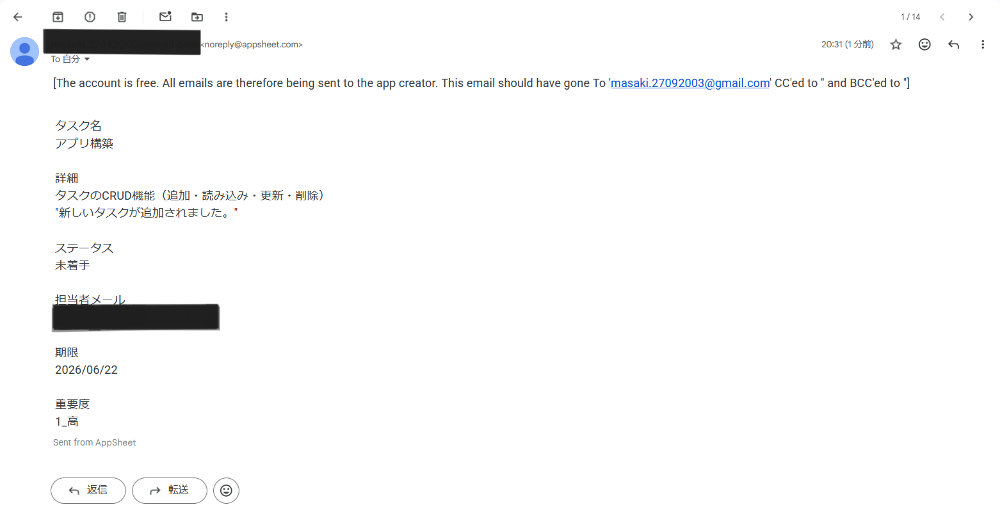

### 7. バックエンドへの自動データ同期
- アプリで入力した内容が、裏側のGoogleスプレッドシートへもユニークなタスクID（独自のキー）と共に正確に自動書き込みされます。
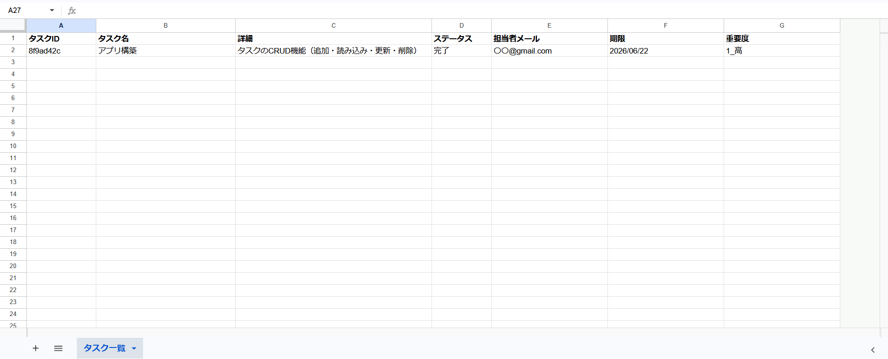

### 8. ワンタップ完了アクション（処理前）
- 詳細画面に設置された「完了する」ボタンです。現場の使いやすさを考慮し、1タップでステータスを更新できる独自アクションを実装しています。
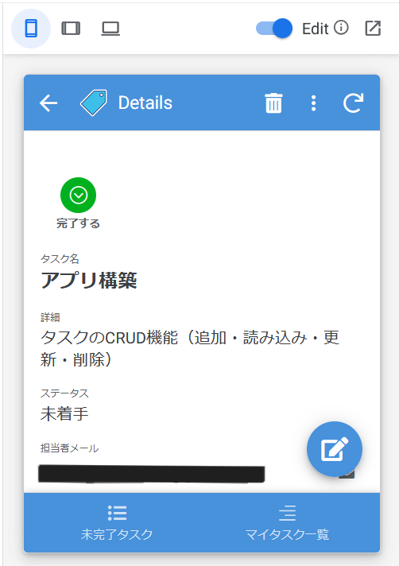

### 9. 完了アクション実行
- アクションボタンをタップした直後の状態です。ステータスが動的に「完了」へと切り替わります。
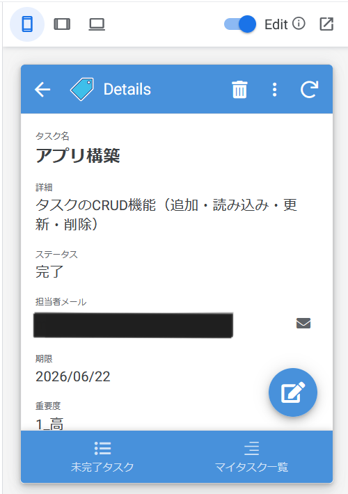

### 10. マイタスク一覧の動的アップデート
- 完了したタスクが一覧から自動的に消え、今やるべき「未完了タスク」だけがスマートに残ります。
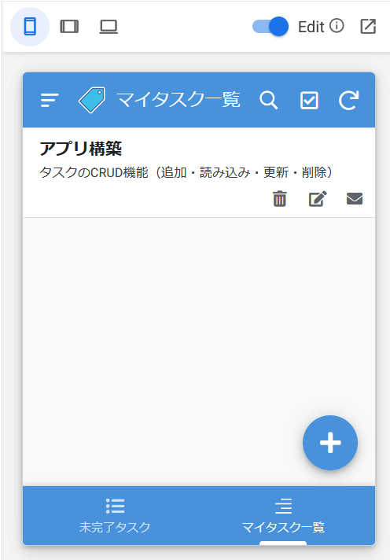

### 11. 複数タスク運用時のリスト画面
- タスクが複数登録された状態の画面です。未完了・完了が混在しても、アプリ側で適切に整理・リスト化されて表示されます。
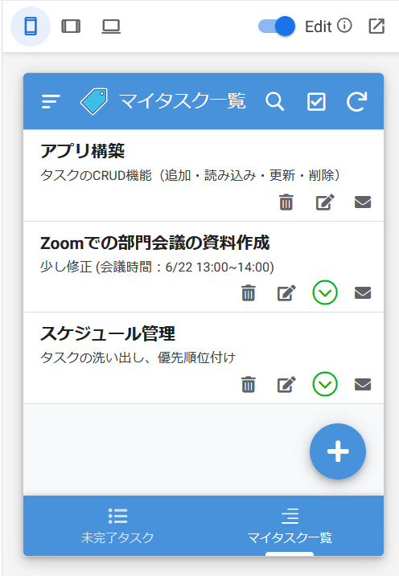

### 12. 最終状態：バックエンドへのリアルタイム反映（データ蓄積）
- 運用を重ねてデータが増えた状態のスプレッドシートです。アプリ側で行ったステータス変更（完了）や新規追加が、ズレなくリアルタイムに蓄積されていることが確認できます。
- ※セキュリティ保護のため、画面内のメールアドレスは「〇○@gmail.com」等のダミー表記に変更・加工を行っています。
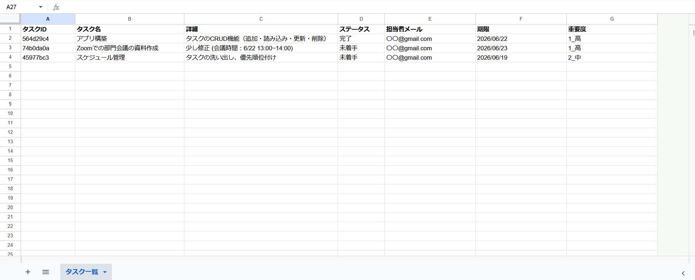

---

## 🔮 今後の拡張計画（さらに追加したい機能）

現状のベースシステムに加え、現場の運用に合わせて以下のような「さらに業務が楽になる機能」の実装（アップデート）を計画・検討しています。

### 1. LINEやSlackへの「チャット自動通知」連携
現在はタスク追加時にメールで通知していますが、現場でよく使われているLINE（LINE Works）やSlack、Microsoft Teamsへのチャット通知へ拡張します。普段使っている連絡ツールに直接通知が飛ぶことで、さらに確認漏れを防ぎ、リアルタイムな情報共有を強化します。

### 2. カレンダービューの追加と期限直前の「自動催促（リマインド）」
タスクの期限日を視覚的に把握しやすくするための「カレンダー表示（Calendar View）」を実装します。さらに、期限の「1日前」や「当日」になってもステータスが完了になっていないタスクをBotが自動で検知し、担当者へ「期限が近づいています！」と自動催促するインテリジェントなリマインド機能を追加します。

### 3. ダッシュボードの高度化（グラフによる見える化）
現在の「個人専用ダッシュボード」をさらに進化させ、月ごとのタスク完了率や、チーム全体の稼働状況を円グラフや棒グラフでパッと一目で「見える化」する統計ビューを強化します。これにより、管理者が「誰に業務が偏っているか」を瞬時に判断できるようになります。
